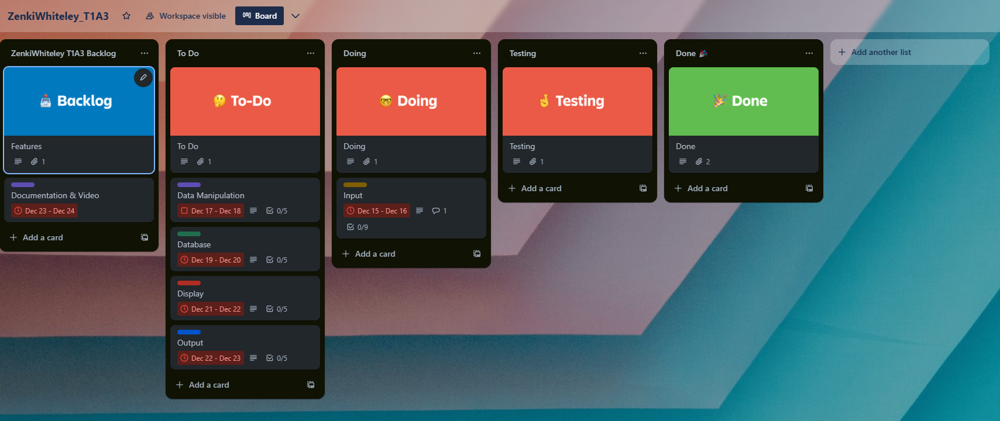
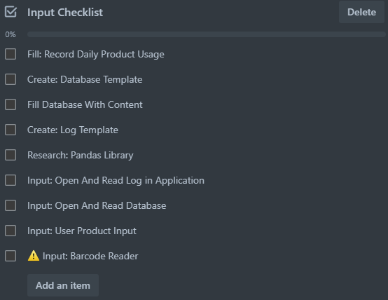
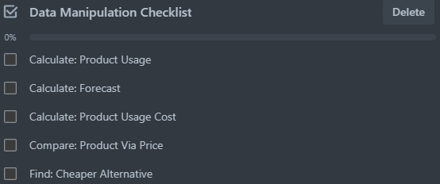
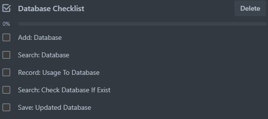
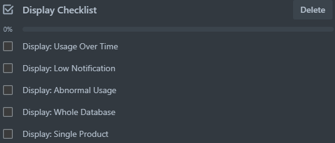
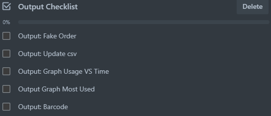

<h1>Inventory Manager Python Application</h1>

A Mini Python Application That Takes In User Input And Log Files, Manipulates Data And Stores It In A Database csv File.

Repositiory: [Github](https://github.com/R-Z-W/ZenkiWhiteley_T1A3)

<h3>Style Guide</h3>
This Python Application Follows The:

 - PEP 8 – Style Guide for Python Code
 - Guide Can Be Found [Here](https://peps.python.org/pep-0008/)

<h3>Project Python Libraries Used</h3>
- pandas
- os
- re
- matplotlib
- shutil
- unittest

<h1>How To Use</h1>

<h3>Setup</h3>

- Open Terminal/Console
    - By Typing In The Search
  	- Windows: ```cmd``` For Command Prompt
  	- Linux/Mac: ```terminal``` For Terminal Emulator	
    - Check Python Version: 
        - Linux/Mac:```python3 --version```
        - Windows: ```python --version```
        - If Python Is Below 3.10 Or Is Not Installed:
            - Install: [python](https://www.python.org/)
- Once Installed or Updated
    - Open Terminal/Console
        - Run Command: ```pip install -r requirements.txt```
        
---

<h3>Running</h3>

- Open Terminal/Console Again
    - Run This Command Everytime You Want To Run The Application: ```python3 inventory_manager.py```


When Application Is Running
```    
    Inventory Manager
    Options:
    Process Log File            = (1)
    Linear Regression Forecast
    (3 Logs Required)           = (2)
    Search/Add Database         = (3)
    Add Product to Order        = (4)
    Display Database            = (5)
    Change Database             = (6)
    Reset Program               = (7)    
        
-Input a Number: 
```
- Above Is What Should Be Displayed In Terminal
    - In-order To Use This Application. Simply Follow The Prompts In The Terminal
        - In This Example, Type In A Number To Choose A Process (Between 1-7)
            - e.g. ```1```

    - Other Prompts May Include:
        - Open Multiple Log Files Y/N: ```Yes```
        - Input Oldest Daily Log File: ```Log.......txt```
        - Currently InUse? True or False: ```True``` 
        - Input Name of Product: ```ProductName```
---
<h3>Reseting Application</h3>

To Reset The Application To Its Original State:
In The Main Menu, Select:

```
    Reset Program               = (7)
```

By typing In ```7``` Into The Console

---
<h3>Exiting Application</h3>

To Close The Application Simply Close The Terminal Or When Prompted:

```
Exit? Y/N: 
```

Type In ```Yes```

---
<h3>Accessing Product Order</h3>

A Product Order File Can Be Found In The Root Of The Application, Called ```productorder.txt```. This File Will Be Empty Unless Products Were Added To The Order During The Applications Execution. Additional Information Will Have To Be Filled In To Complete The Product Order.<br>
Contents Of An Empty Product Order File:
```
Order Form:
Number:
Date:
Author:
Address:
Phone:

Quantity, Item, Price, Total:
```

---

<h3>Using Custom Data</h3>

To Use Custom Data In This Application, Files Must Follow A Specific Criteria In-order For The Application To Run.
Once Created These Custom Datas Are Placed In The Root Folder Of The Application.
This Application Accepts 2 Types Of Custom Data. These Are:

<h4>Log Files</h4>

Log Files Must Be .txt Files.<br>
The Name Convention For The File Must Start With ```Log```<br>
An Example Of An Acceptable Name: ```LogWordsNumbersHere.txt```<br>
Example Of Log File Content:

```
#Place Record Details Here.
#Large(Van, Truck, FullSizeSuv) Medium(Suv, Sedan, SingleCabUte) Small(Compact,Hatchback)
Recorded_Date: 18/12/2023
Recorded_Large_Car: 6
Recorded_Medium_Car: 4
Recorded_Small_Car: 2
#Place Used Products Here.
Earplugs: 5
nitrate gloves: 25														
denatured alcochol: 176
Thinners: 12
```

Log Files Contain 3 Different Types of Data. These Are:
- Comments 
    - Starting with ```#```, these are ignored by the Application allowing for notes to be stored in the log files.
- Recorded & Values
    - Case sensitive ```Recorded``` can be placed in front of data names that the Application will display. 
    - This type of data must have a ```:``` in-order to distinguish between name and value in the Application.
    - <b>!Important!</b> Every log file must have a date, e.g. ```Recorded_Date: 18/12/2023``` in-order for the Application to function properly.
- Names & Values
    - Names can be anything from strings to words and numbers.
    - Values must be numbers that represent the amount of product used on the day.
    - Names and Values must have a ```:``` in-order to distinguish between them in the Application.


<h4>Databases</h4>

A Database File Must Be .csv File.<br>
Database Files Can Have Any Name<br>
An Example Of An Acceptable Name: ```DatabaseName.csv```<br>
The Values Inside A Database File, Must Be Seperated by a ```,```<br>
Example Of Database Content:

```
Name,Category,OverallPrice,UnitQuantity,Extra,UnitPrice,Ratio,InUse,SingleUse
Earplugs,PPE,21,100,1,0.21,2,False,TRUE
safetly glasses,PPE,25.95,1,4,25.95,1,False,FALSE
work knee pads,PPE,28.19,1,1,28.19,1,False,FALSE
Kneeling Pad,PPE,49.5,1,0,49.5,1,False,FALSE
nitrate gloves,PPE,16.5,100,8,0.165,2,False,TRUE
klien tools reusable respirator with replaceable filters,PPE,65,1,0,65,1,False,FALSE
FIGHTECH Reusable Dust Mask,PPE,11.99,1,0,11.99,1,False,FALSE
dual cartridge respirator,PPE,48.57,1,0,48.57,2,False,FALSE
Chemical wipes,PPE,99.58,100,0,0.9958,1,False,TRUE
Koch Chemie Green Star GS Universal Cleaner,All Purpose Cleaner,220.95,10000,0,0.022095,1:5,False,TRUE
```

The Database Contains 9 Columns. These Are:
- Name
    - The Name Of A Product
- Category
    - The Type Of Product
- OverallPrice
    - The Price Of The Product e.g. A Single Drum/Bottle Of Product
    - Must Be A <b>Number</b>
- UnitQuantity
    - The Amount That The Product Contains In ml Or Individual Units.
    - Must Be A <b>Number</b>
- Extra
    - The Extra Amount In Storage e.g. More Drums Of Product
    - Must Be A <b>Number</b>
- UnitPrice
    - Calculated by OverallPrice / Unit Quantity
    - Must Be A <b>Number</b>
- Ratio
    - A Ratio Of Product Per Water
    - Must Be Represented By <b>Number</b> ```1``` or ```1:5```
- InUse
    - Represents If The Product Is In Current Use
    - Must Be A <b>Boolean</b>
- SingleUse
    - Represents If A Product Can Be Re-Used
    - Must Be A <b>Boolean</b>


<h1>Features</h1>
<h4>The Original Features That Were Planned For This Project Were:</h4>

Input A Log Of Daily Product Use
- An Uploadable Log File Will Be Created Everyday To Track The Amount Of Product Used

Display Product Usage Over A Period Of Time
- The Application Will Store Product Use Allowing For A Review Of Product Use Over Time

Forecast Product Usage
- The Application Will Calculate Future Product Use 

Create Fake Orders In Advance 
- The Application Will Place Products In An Order File Before Running Out

Product Notifications If Running Low. 
- A Notification Will Be Generated When The Amount Of Product Left Is Under A Certain Percentage

<h4>The Was Later Expanded To Include:</h4>

- Input File
    - Input Daily Log of Products 
        - Log File Tracked The Amount Of Product Used On A Day
    - Input Product Database
        - A Database That Would Contain A Range Of Different Products

- Data Manipulation
    - Calculate Product Usage
        - Calculate The Total Amount Used
    - Forecast Product Usage
        - Calculate Future Usage
    - Calculate Cost of Product Usage
        - Calculate Total Cost Of Usage
    - Compare Products Via Price
        - Compare Costs Between Products In The Same Category
    - Find Cheaper Alternative
        - Identify The Cheapest Product In Category

- Database
    - Comb Over Database & Check If Exist
        - Identify If The Product Exist In Database.csv
    - Add To Database If Doesnt Exist
        - Add Absent Products To Database.csv
    - Track History Of Product Use
        - Record Product Use In Database.csv
    - Search Database For Products
        - Be Able To Find Products In Database.csv
        
- Display
    - Product Usage Over Time
        - Display Product Usage In Terminal
    - Notification When Low
        - When A Product Uses A Certain Percentage Of Total Amount, Display Notification
    - Notification Above Normal Usage
        - When A Product Is Being Used Over The Normal Amount, Display Notification
    - Database
        - Display The Whole Database.csv In Terminal
  
- Output
    - Create Fake Order
        - Create And Fill In A Fake Order File
    - Create An Updated Spreadsheet
        - Update The csv File With New Data
    - Graph Of Product Usage Over Time
        - Graph Product Usage VS Time
    - Graph Of Most Used Product
        - Graph Products Agaist One Another Off Their Usage
	
- Additions
    - Barcode Generator and Barcode Reader
        - Create And Read Barcodes That Will Autofill Log Files

<h1>Implementation Plan</h1>

<h2>Trello Board</h2>



<h2>Trello Checklists</h2>







<h1>Implemented Features</h1>

<h4>The Final Application Included Features:</h4>

- Input File
    - Input Daily Log of Products 
    - Input Product Database

- Data Manipulation
    - Calculate Product Usage
    - Forecast Product Usage
    - <b>New</b> Move Used Logs To A Seperate Folder 
        - Logs That Had Already Been Scanned, Were Moved To A Seperate Folder
    - <b>New</b> Reset Data
        - Reset All Data To Default Values

- Database
    - Comb Over Database & Check If Exist
    - Add To Database If Doesnt Exist
    - Track History Of Product Use
    - Search Database For Products
        
- Display
    - Product Usage Over Time
    - Notification When Low
    - Database
  
- Output
    - Create Fake Order
    - Create An Updated Spreadsheet
    - Graph Of Product Usage Over Time
